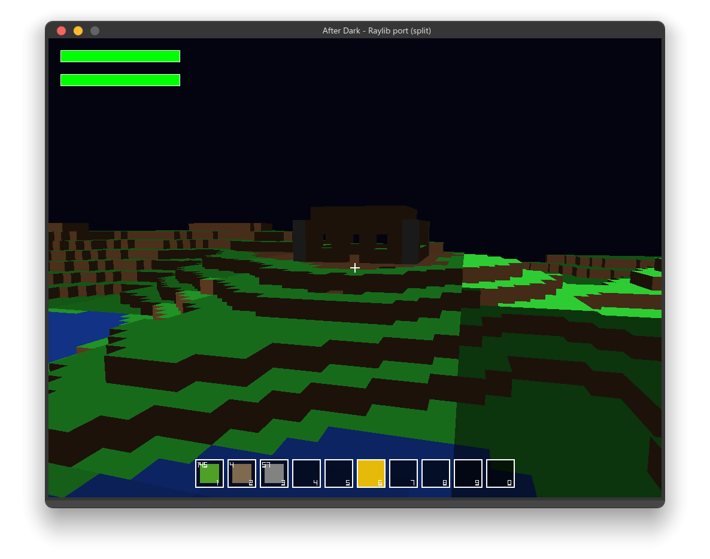
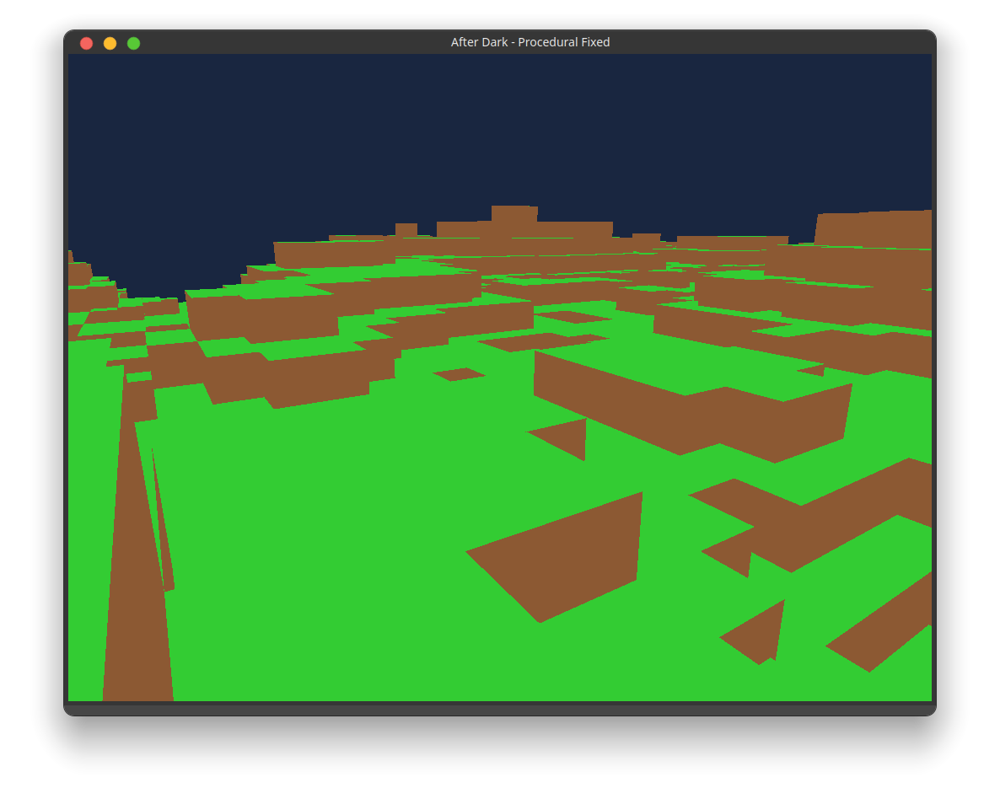

  

# AfterDark™

 
 
 

**A Minecraft Clone created in C++ using raylib**

---
## Release Status

**These are all in BETA Release, so bugs *might* occur =)**

---

## Features

- Infinite procedurally generated voxel terrain
- Real-time dynamic lighting and shadows
- Water physics with depth-based shading
- Async chunk generation for smooth gameplay
- Pause menu and in-game inventory system
- Keyboard & mouse controls with adjustable sensitivity
- Save/Load system for persistent worlds

---

## Screenshots

<table>
<tr>
<td></td>
<td></td>
</tr>
</table>

---

## Controls 🎮

| Action             | Key / Mouse |
|-------------------|-------------|
| Move Forward       | W           |
| Move Backward      | S           |
| Strafe Left        | A           |
| Strafe Right       | D           |
| Jump               | Space       |
| Look Around        | Mouse       |
| Pause Menu         | Esc         |
| Place Block        | Left Click  |
| Remove Block       | Right Click |

---

Just download the executables above (Depending on your platform) and run.

---

## Dependencies

Install Raylib in order for it to work:

https://github.com/raysan5/raylib

Also thanks to the developers of raylib for making this project possible!
